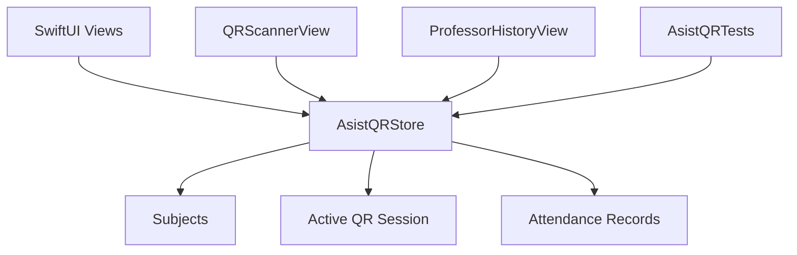

# Laboratorio 4 - AsistQR

## 1. Titulo e integrantes

Proyecto: AsistQR.

AsistQR es una aplicacion iOS para registrar asistencia academica mediante codigos QR por sesion.

Integrantes: pendiente de completar por el equipo antes de entregar la presentacion.

## 2. Funcionalidad planificada inicialmente

- Registro e inicio de sesion de profesor y alumno.
- Creacion y gestion de asignaturas por parte del profesor.
- Generacion o activacion de QR para una sesion de clase.
- Escaneo de QR por parte del alumno para registrar asistencia.
- Consulta de historico por asignatura y alumno.
- Exportacion de registros de asistencia.

## 3. Requisitos implementados y asociacion funcional

| Requisito | Funcionalidad asociada | Estado |
| --- | --- | --- |
| RF-01 Seleccion de perfil | Pantalla inicial con rol Alumno/Profesor | Implementado |
| RF-02 Registro/Login | Formularios de registro e inicio de sesion simulados | Implementado como MVP |
| RF-03 Gestion de asignaturas | Listado y creacion de asignaturas | Implementado en memoria |
| RF-04 Control de sesion QR | Profesor habilita/deshabilita QR y define caducidad | Implementado en memoria |
| RF-05 Registro de asistencia | Alumno registra asistencia desde QR o entrada manual | Implementado en memoria |
| RF-06 Historico | Profesor y alumno consultan registros filtrados | Implementado |
| RF-07 Exportacion | Profesor exporta CSV con vista previa y comparticion | Implementado |
| RNF-01 Pruebas automatizadas | Unit tests de store, asistencia y CSV | Implementado |
| RNF-02 Integracion continua | GitHub Actions para pruebas iOS | Implementado |

## 4. Arquitectura



La app usa una arquitectura simple de cliente iOS:

- `SwiftUI Views`: pantallas de autenticacion, profesor, alumno, escaner, historico y exportacion.
- `AsistQRStore`: estado compartido en memoria mediante `ObservableObject`.
- `QRScannerView`: integra lectura QR con `AVFoundation` y entrada manual para demo.
- `AsistQRTests`: pruebas unitarias sobre la logica de negocio.

## 5. Interfaz y asociacion con requisitos

| Pantalla | Requisitos cubiertos |
| --- | --- |
| `AuthLandingView` | RF-01, RF-02 |
| `StudentHomeView` | RF-05, RF-06 |
| `QRScannerView` | RF-05 |
| `AttendanceListView` | RF-06 |
| `ProfessorHomeView` | RF-03, RF-04, RF-06, RF-07 |
| `SubjectsListView` / `CreateSubjectView` | RF-03 |
| `SessionControlView` | RF-04 |
| `ProfessorHistoryView` / `CSVExportView` | RF-06, RF-07 |

## 6. Plan de pruebas

Pruebas automatizadas incluidas:

- Crear asignatura valida.
- Rechazar asignatura incompleta.
- Habilitar sesion y registrar asistencia con codigo correcto.
- Evitar duplicados de asistencia en la misma sesion.
- Rechazar asistencia cuando la sesion esta deshabilitada.
- Exportar CSV filtrado.
- Escapar correctamente comas y comillas en CSV.

Comando local:

```bash
xcodebuild test \
  -project ios/AsistQR/AsistQR.xcodeproj \
  -scheme AsistQR \
  -destination 'platform=iOS Simulator,name=iPhone 17' \
  -only-testing:AsistQRTests
```

Automatizacion:

- Workflow `iOS Tests`: ejecuta `AsistQRTests` en GitHub Actions.
- Workflow `CodeQL`: analisis de seguridad cuando existan fuentes compatibles.
- Workflow `Dependency Review`: revision de dependencias en pull requests.

## 7. Guion de demo

Duracion objetivo: 3 a 5 minutos.

1. Mostrar pantalla inicial y seleccionar Profesor.
2. Entrar con login simulado.
3. Crear una asignatura.
4. Abrir la sesion activa y habilitar QR.
5. Mostrar codigo generado y estado de QR habilitado.
6. Volver al flujo de alumno.
7. Registrar asistencia con entrada manual usando el codigo de sesion.
8. Mostrar confirmacion de asistencia.
9. Volver al profesor y abrir Historico.
10. Filtrar registros por asignatura o alumno.
11. Exportar CSV y mostrar vista previa.

## 8. Limitaciones conocidas

- La persistencia es en memoria. Al cerrar la app se reinician los datos.
- Registro/login son simulados para MVP.
- No hay backend ni base de datos remota.
- El QR se maneja como codigo de sesion y lectura/entrada manual; la generacion visual completa de QR puede ser una mejora futura.

## 9. Mejoras futuras

- Persistencia local con SwiftData o Core Data.
- Backend para usuarios, asignaturas y asistencia real.
- Autenticacion institucional.
- QR visual generado desde payload firmado.
- Roles y permisos reales.
- Exportacion a archivo `.csv` con nombre de asignatura y fecha.
